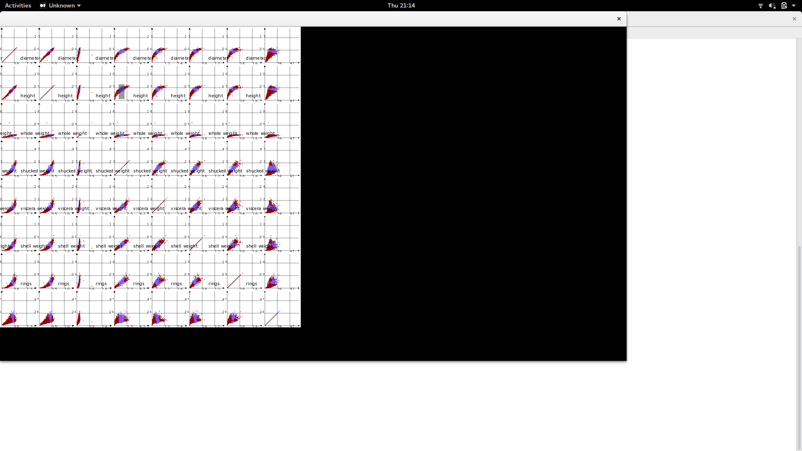
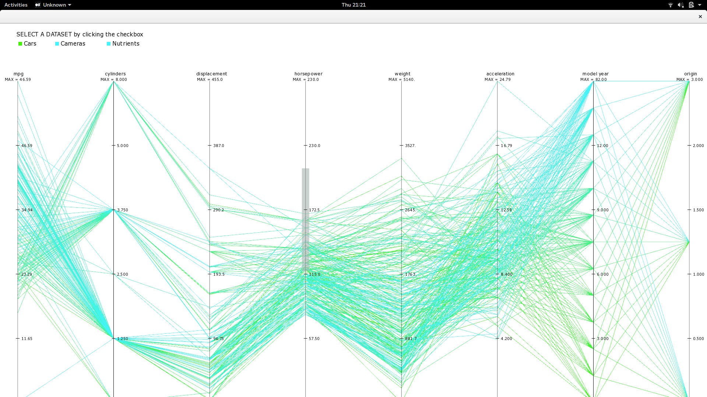
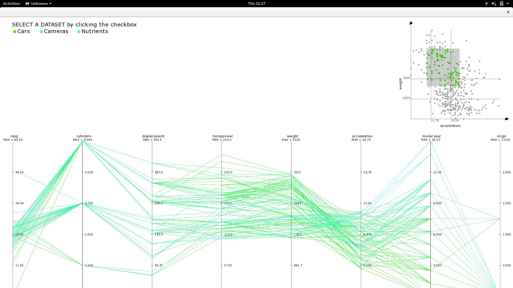
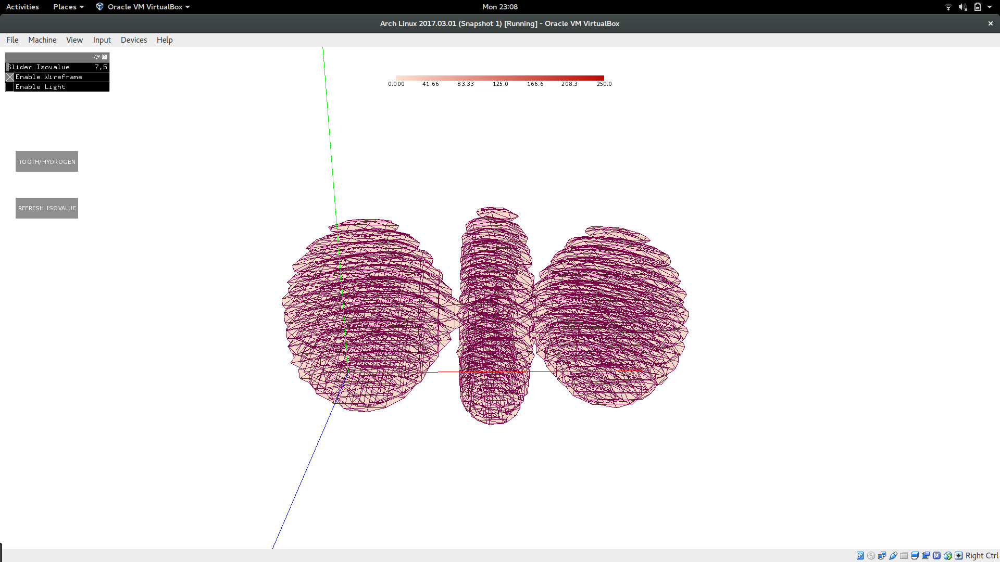
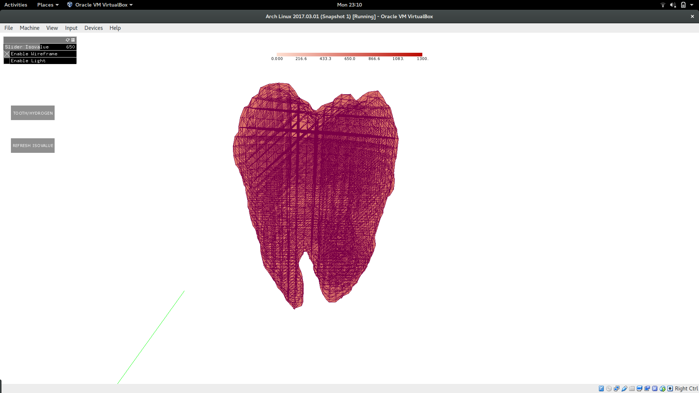
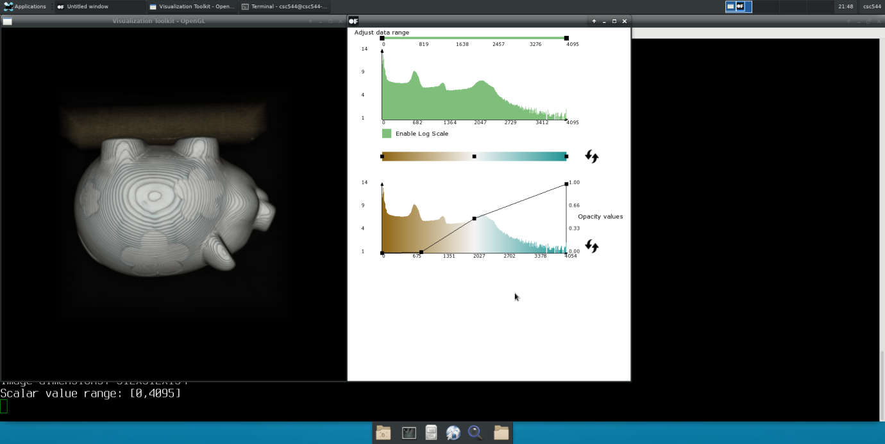
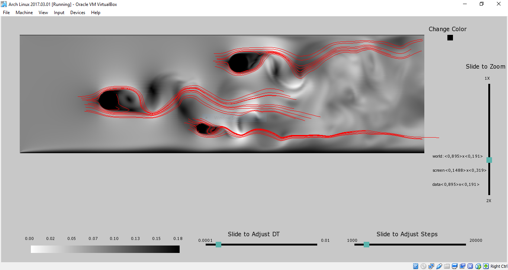

# InformationViz
Various information visualization tools
## Scatterplot Matrix

## Parallel Coordinates

## Hybrid Parallel Coordinates

## Slice View


## Isosurface


## Transfer Function

## Vectors

## Dependency
1. Openframeworks https://github.com/openframeworks/openFrameworks
2. VTK http://www.vtk.org/download/
## Build
```
cd <viz>
mkdir build
cd build
cmake ../CMakeLists.txt
cd ..
make
```
Example:
```
cd ScatterPlot
mkdir build
cd build
cmake ../CMakeLists.txt
cd ..
make
```
## Run
```
cd <viz>
./bin/<viz>
```
Example:
```
cd ScatterPlot
./bin/ScatterPlot
```
